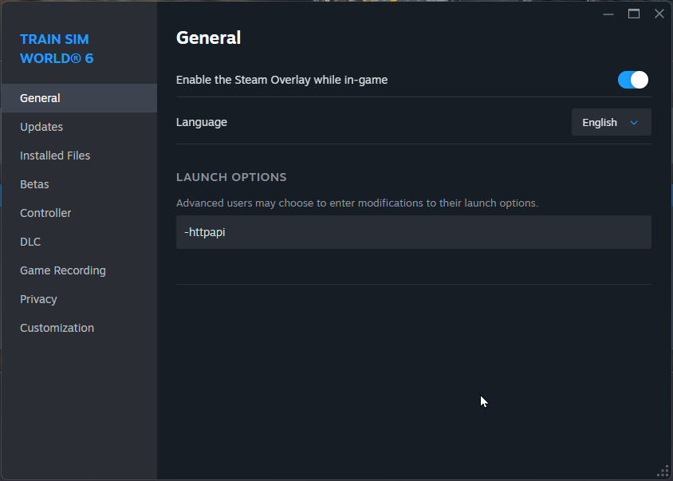

# TSW Connect
Connect to TSW using -HTTPAPI and extract player, track and other vehicle data

<!-- Improved compatibility of back to top link: See: https://github.com/othneildrew/Best-README-Template/pull/73 -->
<a id="readme-top"></a>
<!--
*** Thanks for checking out the Best-README-Template. If you have a suggestion
*** that would make this better, please fork the repo and create a pull request
*** or simply open an issue with the tag "enhancement".
*** Don't forget to give the project a star!
*** Thanks again! Now go create something AMAZING! :D
-->


<!-- PROJECT SHIELDS -->
<!--
*** I'm using markdown "reference style" links for readability.
*** Reference links are enclosed in brackets [ ] instead of parentheses ( ).
*** See the bottom of this document for the declaration of the reference variables
*** for contributors-url, forks-url, etc. This is an optional, concise syntax you may use.
*** https://www.markdownguide.org/basic-syntax/#reference-style-links
-->
[![Contributors][contributors-shield]][contributors-url]
[![Forks][forks-shield]][forks-url]
[![Stargazers][stars-shield]][stars-url]
[![Issues][issues-shield]][issues-url]
[![project_license][license-shield]][license-url]
[![LinkedIn][linkedin-shield]][linkedin-url]

<!-- PROJECT LOGO -->
<br />
<div align="center">
  <a href="https://github.com/TheJAG/tsw_connect">
    
  </a>

<h3 align="center">Train Sim World Connect</h3>

  <p align="center">
    project_description
    <br />
    <a href="https://github.com/TheJAG/tsw_connect"><strong>Explore the docs »</strong></a>
    <br />
    <br />
    <a href="https://github.com/TheJAG/tsw_connect">View Demo</a>
    &middot;
    <a href="https://github.com/TheJAG/tsw_connect/issues/new?labels=bug&template=bug-report---.md">Report Bug</a>
    &middot;
    <a href="https://github.com/TheJAG/tsw_connect/issues/new?labels=enhancement&template=feature-request---.md">Request Feature</a>
  </p>
</div>


<!-- TABLE OF CONTENTS -->
<details>
  <summary>Table of Contents</summary>
  <ol>
    <li>
      <a href="#about-the-project">About The Project</a>
      <ul>
        <li><a href="#built-with">Built With</a></li>
      </ul>
    </li>
    <li>
      <a href="#getting-started">Getting Started</a>
      <ul>
        <li><a href="#prerequisites">Prerequisites</a></li>
        <li><a href="#installation">Installation</a></li>
      </ul>
    </li>
    <li><a href="#usage">Usage</a></li>
    <li><a href="#roadmap">Roadmap</a></li>
    <li><a href="#contributing">Contributing</a></li>
    <li><a href="#license">License</a></li>
    <li><a href="#contact">Contact</a></li>
    <li><a href="#acknowledgments">Acknowledgments</a></li>
  </ol>
</details>


<!-- ABOUT THE PROJECT -->
## About The Project

This project aims to leverage the Train Sim World HTTPAPI to extract player, track and other vehicle data. The key is generating GIS files for further processing.
<p align="right">(<a href="#readme-top">back to top</a>)</p>


### Built With

<!-- Tech Stack Badges -->
[![Python][Python.org]][Python-url]
[![PyPI][PyPI.org]][PyPI-url]
[![License][License.com]][License-url]

<!-- Badge References -->
[Python.org]: https://img.shields.io/badge/python-3.14-blue?style=for-the-badge&logo=python&logoColor=white
[Python-url]: https://www.python.org/

[PyPI.org]: https://img.shields.io/pypi/v/your-package?style=for-the-badge&logo=pypi&logoColor=white
[PyPI-url]: https://pypi.org/project/your-package/

[License.com]: https://img.shields.io/pypi/l/your-package?style=for-the-badge&logo=opensourceinitiative&logoColor=white
[License-url]: https://pypi.org/project/your-package/

<p align="right">(<a href="#readme-top">back to top</a>)</p>


<!-- GETTING STARTED -->
## Getting Started

To get a local copy up and running follow these simple example steps.

### Prerequisites

1. Have a working copy of Train Sim World installed.
2. Add parameter to Steam in the game's launch options: `-httpapi`

<!-- STEAM HTTPAPI -->

  <a href="https://github.com/TheJAG/tsw_connect">
    
  </a>

3. Run the game once to generate the CommAPIKey.txt file. The location defaults to `Documents\My Games\TrainSimWorld6\Saved\Config\CommAPIKey.txt `

### Repo installation

1. Clone the repo
   ```sh
   git clone https://github.com/TheJAG/tsw_connect.git
   ```
2. Create virtual environment
   ```sh
   C:\Python314\python.exe -m venv .venv
   ```
3. Activate environment
   ```sh
   .venv\scripts\activate.bat
   ```
4. Install the requirements using the pip build backend (pyproject.toml)
   ```sh
   pip install .
   pip install .[dev]  # for developers
   ```

<p align="right">(<a href="#readme-top">back to top</a>)</p>


<!-- USAGE EXAMPLES -->
## Usage

WIP :)

_For more examples, please refer to the [Documentation](https://example.com)_

<p align="right">(<a href="#readme-top">back to top</a>)</p>


<!-- ROADMAP -->
## Roadmap

- [ ] Feature 1
- [ ] Feature 2
- [ ] Feature 3
    - [ ] Nested Feature

See the [open issues](https://github.com/TheJAG/tsw_connect/issues) for a full list of proposed features (and known issues).

<p align="right">(<a href="#readme-top">back to top</a>)</p>


<!-- CONTRIBUTING -->
## Contributing

Contributions are what make the open source community such an amazing place to learn, inspire, and create. Any contributions you make are **greatly appreciated**.

If you have a suggestion that would make this better, please fork the repo and create a pull request. You can also simply open an issue with the tag "enhancement".
Don't forget to give the project a star! Thanks again!

1. Fork the Project
2. Create your Feature Branch (`git checkout -b feature/AmazingFeature`)
3. Commit your Changes (`git commit -m 'Add some AmazingFeature'`)
4. Push to the Branch (`git push origin feature/AmazingFeature`)
5. Open a Pull Request

<p align="right">(<a href="#readme-top">back to top</a>)</p>

### Top contributors:

<a href="https://github.com/TheJAG/tsw_connect/graphs/contributors">
  
</a>


<!-- LICENSE -->
## License

Distributed under the project_license. See `LICENSE.txt` for more information.

<p align="right">(<a href="#readme-top">back to top</a>)</p>


<!-- CONTACT -->
## Contact

Michiel Jagersma - m_jagersma@hotmail.com

Project Link: [https://github.com/TheJAG/tsw_connect](https://github.com/TheJAG/tsw_connect)

<p align="right">(<a href="#readme-top">back to top</a>)</p>


<!-- ACKNOWLEDGMENTS -->
## Acknowledgments

* [Dovetail Games](https://forums.dovetailgames.com/)

<p align="right">(<a href="#readme-top">back to top</a>)</p>


<!-- MARKDOWN LINKS & IMAGES -->
<!-- https://www.markdownguide.org/basic-syntax/#reference-style-links -->
[contributors-shield]: https://img.shields.io/github/contributors/TheJAG/tsw_connect.svg?style=for-the-badge
[contributors-url]: https://github.com/TheJAG/tsw_connect/graphs/contributors
[forks-shield]: https://img.shields.io/github/forks/TheJAG/tsw_connect.svg?style=for-the-badge
[forks-url]: https://github.com/TheJAG/tsw_connect/network/members
[stars-shield]: https://img.shields.io/github/stars/TheJAG/tsw_connect.svg?style=for-the-badge
[stars-url]: https://github.com/TheJAG/tsw_connect/stargazers
[issues-shield]: https://img.shields.io/github/issues/TheJAG/tsw_connect.svg?style=for-the-badge
[issues-url]: https://github.com/TheJAG/tsw_connect/issues
[license-shield]: https://img.shields.io/github/license/TheJAG/tsw_connect.svg?style=for-the-badge
[license-url]: https://github.com/TheJAG/tsw_connect/blob/master/LICENSE.txt
[linkedin-shield]: https://img.shields.io/badge/-LinkedIn-black.svg?style=for-the-badge&logo=linkedin&colorB=555
[linkedin-url]: https://linkedin.com/in/linkedin_username
[product-screenshot]: images/screenshot.png
<!-- Shields.io badges. You can a comprehensive list with many more badges at: https://github.com/inttter/md-badges -->
[Next.js]: https://img.shields.io/badge/next.js-000000?style=for-the-badge&logo=nextdotjs&logoColor=white
[Next-url]: https://nextjs.org/
[React.js]: https://img.shields.io/badge/React-20232A?style=for-the-badge&logo=react&logoColor=61DAFB
[React-url]: https://reactjs.org/
[Vue.js]: https://img.shields.io/badge/Vue.js-35495E?style=for-the-badge&logo=vuedotjs&logoColor=4FC08D
[Vue-url]: https://vuejs.org/
[Angular.io]: https://img.shields.io/badge/Angular-DD0031?style=for-the-badge&logo=angular&logoColor=white
[Angular-url]: https://angular.io/
[Svelte.dev]: https://img.shields.io/badge/Svelte-4A4A55?style=for-the-badge&logo=svelte&logoColor=FF3E00
[Svelte-url]: https://svelte.dev/
[Laravel.com]: https://img.shields.io/badge/Laravel-FF2D20?style=for-the-badge&logo=laravel&logoColor=white
[Laravel-url]: https://laravel.com
[Bootstrap.com]: https://img.shields.io/badge/Bootstrap-563D7C?style=for-the-badge&logo=bootstrap&logoColor=white
[Bootstrap-url]: https://getbootstrap.com
[JQuery.com]: https://img.shields.io/badge/jQuery-0769AD?style=for-the-badge&logo=jquery&logoColor=white
[JQuery-url]: https://jquery.com 
